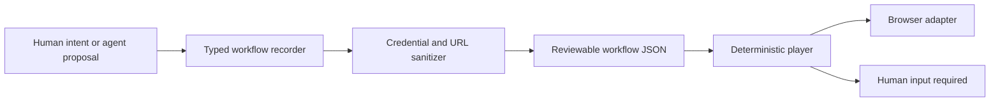

# AI Portal Automation

**A privacy-aware workflow recorder and deterministic playback core for browser agents.**

[](https://github.com/lisir202446/ai-portal-automation/actions/workflows/verify.yml)
[](tests/workflow-recorder.test.cjs)
[](tsconfig.json)

## The product decision

Natural-language browser automation is easy to demo and hard to trust. The dangerous part is not generating a click sequence; it is knowing what will run, preventing credentials from entering logs, and stopping when a human must provide sensitive input.

This project explores a bounded intermediate layer:

> An AI agent may propose a workflow, but the workflow must become a typed, reviewable artifact before a browser adapter can execute it.

That leads to a deliberately small core instead of an “enterprise-grade” claim without the supporting system.

## What the prototype proves

| Product concern | Implemented behavior |
| --- | --- |
| Explicit user control | Actions are accepted only between `start()` and `stop()`; recording outside that boundary fails. |
| Inspectable plans | Every workflow uses a versioned schema with `navigate`, `click`, `input`, and `wait` actions. |
| Secret hygiene | Password/token/API-key selectors store `[REDACTED]` instead of the typed value. |
| URL hygiene | Embedded credentials are removed and sensitive query values are redacted. |
| Human handoff | Playback stops with `needs-input` before a redacted value would be entered. |
| Deterministic execution | A reviewed workflow is dispatched to a browser adapter in order. |

## Architecture



The adapter boundary keeps browser vendors and automation drivers outside the domain model. A Playwright, Chrome extension, or remote-browser adapter can implement the same four methods without changing the recording and safety rules.

## Example

```ts
import { WorkflowPlayer, WorkflowRecorder } from "ai-portal-automation"

const recorder = new WorkflowRecorder()
recorder.start()
recorder.record({ type: "navigate", url: "https://example.com/tasks" })
recorder.record({ type: "click", selector: "#new-task" })
recorder.record({ type: "input", selector: "#title", value: "Review launch" })
const workflow = recorder.stop()

const player = new WorkflowPlayer(browserAdapter)
const result = await player.run(workflow)
```

If the selector contains `password`, `secret`, `token`, or `api-key`, the recorded value is replaced with `[REDACTED]`. Playback returns the selector and action index so the host product can request the value at execution time.

## Agent-native execution

The workflow schema is the collaboration contract between product intent, an AI agent, and the execution runtime:

1. A user or agent proposes browser actions.
2. The recorder normalizes them into an inspectable artifact.
3. Safety rules redact values before persistence.
4. A person or policy layer reviews the plan.
5. The player executes only through an injected browser adapter.
6. Sensitive steps return control to the user.

This structure makes agent behavior observable and testable instead of treating the model as an unbounded macro engine.

## Evidence

```bash
npm ci
npm test
```

The verification suite covers five user-visible contracts:

- explicit recording sessions;
- sensitive input redaction;
- URL credential and token redaction;
- human handoff for missing secrets;
- ordered adapter execution.

CI performs a clean install, strict TypeScript build, and Node test run. The Git history and current tree are also checked for committed secrets before publication.

## Repository map

- [`src/lib/automation/workflow-recorder.ts`](src/lib/automation/workflow-recorder.ts) — typed recorder, sanitization policy, and player.
- [`tests/workflow-recorder.test.cjs`](tests/workflow-recorder.test.cjs) — behavior contracts using a real compiled build.
- [`.github/workflows/verify.yml`](.github/workflows/verify.yml) — clean reproducibility gate.

## Ownership and current limits

This repository is my independent prototype. It does **not** currently include a browser extension UI, a hosted control plane, an LLM prompt layer, or an unattended production runner. The browser adapter is intentionally injected rather than bundled.

Those are explicit scope boundaries: the project demonstrates the safety and execution contract that a larger AI automation product would build on, not a finished automation platform.

## 中文说明

这是一个面向浏览器 Agent 的隐私感知工作流内核。核心产品判断是：自然语言生成操作步骤并不难，真正需要解决的是执行前可审查、凭据不落盘、敏感步骤必须交还用户，以及回放过程可验证。

项目用 5 个自动化测试证明显式录制边界、密码与 Token 脱敏、敏感输入暂停和确定性回放。它不是伪装成完整平台的占位仓库，而是一个边界清晰、可以继续接入 Playwright 或 Chrome 扩展的最小可信原型。

## License

[MIT](LICENSE)
